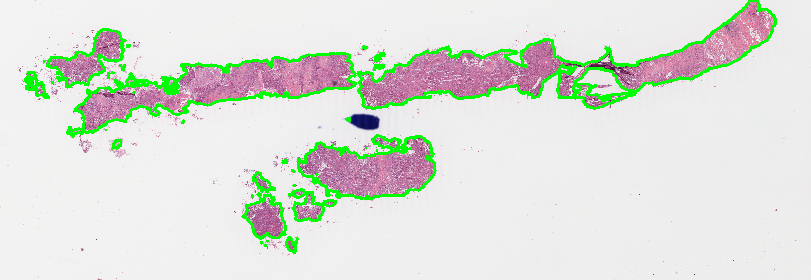
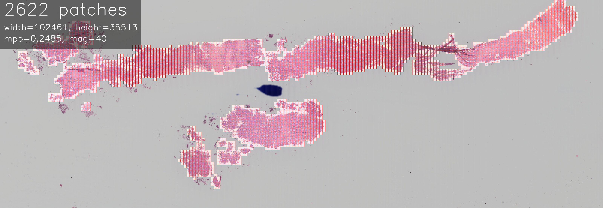

## Quality Control

trident outputs a variety of files for quality control. It is recommended that you review these files after each step to ensure that the results are as expected.

1. Segmentation contours are saved in the `./<job_dir>/contours` directory. These are thumbnails of the WSI with the tissue contours drawn in green.



2. Patch annotations are saved in the `./<job_dir>/<patch_dir>/visualization` directory. These are thumbnails of the WSI with the patch borders drawn in red.



## Custom Pipelines

Trident provides two simple `encoder_factory` functions for loading many patch and slide encoders through a unified API. You can import `encoder_factory` and load pretrained foundation model encoders into your own pipeline for inference or finetuning.

### Patch Encoders
```python
from trident.patch_encoder_models.load import encoder_factory
encoder = encoder_factory("uni_v1") # Or any other encoder name
# Attributes:
print(encoder.enc_name)         # Model name 
print(encoder.eval_transforms)  # PyTorch transforms to process the input image
print(encoder.precision)        # Recommended precision to run the model
```

### Slide Encoders
```python
from trident.slide_encoder_models.load import encoder_factory
encoder = encoder_factory("titan") # Or any other encoder name
# Attributes:
print(encoder.enc_name)         # Model name
print(encoder.precision)        # Recommended precision to run the model
```

Some encoders take optional keyword arguments. For example, the `conch_v1` encoder can be run with or without the projection head. These keyword arguments can be passed directly to encoder_factory:

```python
encoder = encoder_factory("conch_v1", with_proj=True)
```

## Need for Speed
Trident offers two optional ways to meet those conference deadlines on short notice: caching and multiprocessing.

### Caching
If your WSIs are on a cloud directory, it may be beneficial to copy them to a local directory before feature extraction. This is because the time it takes to read a WSI from a remote location is often longer than the time it takes to process the WSI locally. To do this, you can specify a path for `wsi_cache` when initializing Trident (see `run_trident.py`). If you do not specify `wsi_cache`, Trident will process the WSIs directly from `wsi_source_dir`. Caching is only recommended if you plan to do feature extraction; otherwise, the benefit of caching is typically outweighed by the I/O cost of copying the WSIs.

Here is an example workflow using caching:
1. Run segmentation and patching normally, without caching.
2. We will use the cache for feature extraction. To copy WSIs to the cache, run this command:
```bash
python run_batch_of_slides.py --task cache --job_dir ./trident_processed --wsi_dir wsis --wsi_cache cache_dir
```
3. While the WSIs are being transferred, you can start a feature extraction job in a separate terminal window, pointing to the same `wsi_cache` directory. For example:
```bash
python run_batch_of_slides.py --task feat --wsi_dir wsis --job_dir ./trident_processed --patch_encoder uni_v1 --mag 20 --patch_size 256 --wsi_cache cache_dir
```
This instance will automatically use the cached WSIs if they are available, or skip to the next WSI if they are not.

If you are running low on storage, you can set `clear_cache` to `True` in the feature extraction job. This will delete the cached WSIs as they are processed. Note that this assumes the caching job can run faster than the feature extraction job. Otherwise, the feature extraction job will skip slides because the caching job has not yet finished transferring them. If you find this is happening, you can rerun the feature extraction job once the caching job has finished.

> [!WARNING]
> Be careful when setting `clear_cache` to `True`. Make sure `wsi_cache` is set to the correct directory. Otherwise, you may accidentally delete your original copy of the raw WSIs.

### Multiprocessing
Trident supports flexible multiprocessing, so you can run many instances of caching, segmentation, patching, or feature extraction in parallel and they will automatically avoid conflicts by "leapfrogging" each other. Before processing a slide, Trident creates a lockfile of the form `{slide_name}.lock`. If another Trident instance tries to process the same slide, it will see the lock and skip to the next slide.

Here is an example workflow using multiprocessing:
1. Open a terminal window (it is highly recommended you use [tmux](https://github.com/tmux/tmux/wiki) so that processes continue running even if your computer sleeps) and start a segmentation job:
```bash
python run_batch_of_slides.py --task seg --wsi_dir ./wsis --job_dir ./trident_processed --gpu 0
```
2. Open another terminal window (or another tmux pane) and run the exact same command.
3. Repeat Step 2 one or more times to spawn additional processes depending on how powerful your computer is. Be careful not to overload your machine, see Tips below:

#### Tips:
- Running multiple instances in parallel does not necessarily speed up processing, because of CPU or I/O bottlenecks. For example, on my machine I find that running more than 3 feature extraction instances in parallel causes things to lock up. Running multiple instances of the same task is probably only helpful if your bottleneck is the GPU. Keep track of your CPU load using `htop`.
- If you are concurrently running two consecutive tasks (e.g., patching and feature extraction), make sure that the upstream task is faster than the downstream task. Otherwise, the downstream task will end up skipping slides because the upstream task has not yet finished processing them. In case this happens, just rerun the downstream task once the upstream task has finished.

## Under the Hood

### Segmentation
Segmentation is performed by a deep learning model. 2 options: HEST segmenter, a [DeepLabV3 model](https://arxiv.org/abs/1706.05587v3) finetuned specifically to segment tissue from background in WSIs (`--segmenter hest`), or GrandQC segmenter, published in [Nat. Comm](https://www.nature.com/articles/s41467-024-54769-y) which can be used with `--segmenter grandqc`. 

### Patching
Trident's patching module is deterministic and extracts a set of patch coordinates given a tissue mask. Patches are extracted at a particular size (`patch_size`) and particular magnification (`mag`). Trident will attempt to read the base resolution of the WSI and calculate the appropriate downsample factor to extract patches at the desired magnification. Patches can either be nonoverlapping (`overlap == 0`) or overlapping (`overlap > 0`), where `overlap` refers to the absolute overlap in pixels. Trident keeps all patches that contain at least one pixel of tissue.

### Feature Extraction
Given a set of WSIs and patch coordinates, Trident's feature extraction module extracts features from the patches using a pretrained image encoder and associated transforms. Internally, Trident extracts patches from each WSI in batches and applies the provided transformations to them, then feeds them through the image encoder. The resulting patch features (shape (`num_patches`, `feature_dim`)) can be saved as h5 or pt files.

The `batch_size` parameter can be used to limit the number of patches processed in parallel. It is recommended to set `batch_size` as high as possible without running out of VRAM. The provided image encoder has only the following requirements: (1) must subclass `nn.Module`, (2) must have a `forward` method which takes a tensor of shape (b c h w) and returns a tensor of shape (b f). The image encoder must also have a `transforms` attribute, which should resize the image to the size expected by the image encoder and apply any other necessary transformations (including normalization and conversion to tensor). 
